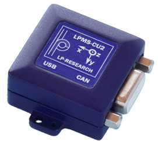
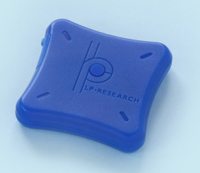
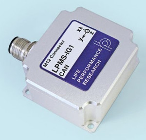
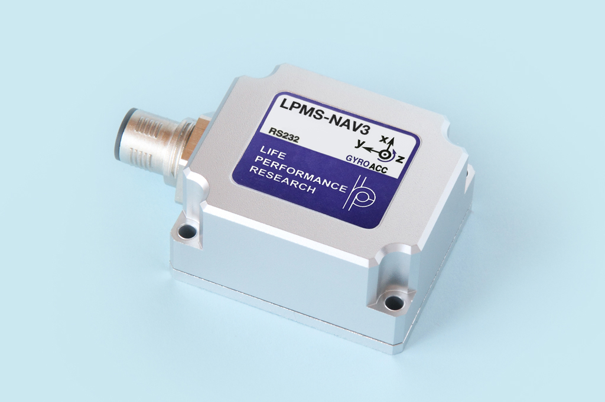
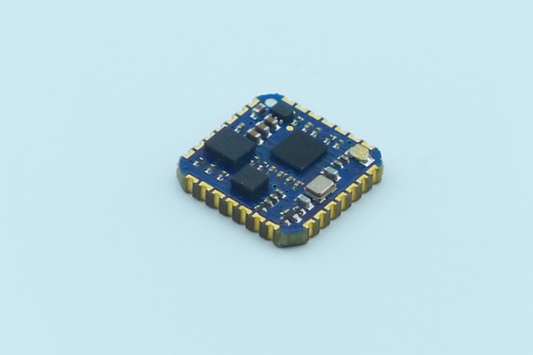
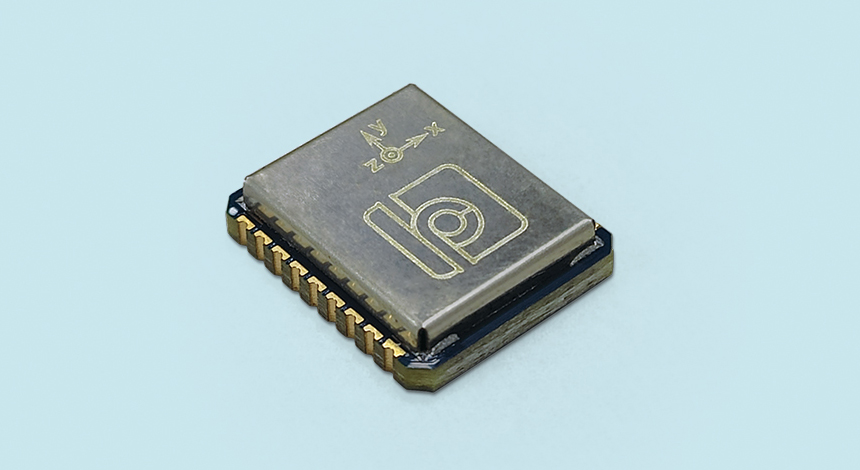

.. _supported-sensors-label:

#################
Supported Sensors
#################

According to the different sets of sensor commands a sensor has adpoted, we categorized sensors into 2 groups:

- **LPMS2** sensors: LPMS-U2 sereis, LPMS-B2, LPMS-ME, LPMS-BE.
- **LPMS3** sensors: LPMS-IG1, LPMS-IG1P, LPMS-U3 series, LPMS-NAV3.

For detailed information of all our sensors, please visit our `Knowledge Base <https://lp-research.atlassian.net/wiki/spaces/LKB/pages/1100611840/LPMS+Documentation>`__.

**Note:** Please be aware that most sensors only come with 1 gyroscope. ``data.g0`` holds angular velocity values from high-precision gyroscope, whereas ``data.g1`` holds values from general purpose gyroscope. When a sensor only has 1 gyroscope, there is only 1 key that holds a valid value.

.. list-table:: Sensors and its Gyro Key Name
   :header-rows: 1

   * - Field name
     - IG1 / IG1P
     - U2 / U3
     - NAV3
     - BE / ME
     - B2
   * - g1
     - o
     - x
     - x
     - x
     - o
   * - g2
     - o
     - o
     - o
     - o
     - x

LP-Research LPMS-U2 / U3 Series
===============================
Sensor's model name could start with *CU*, *URS* or *UTTL*, and followed by number 2 or 3.

Product Link: 
`LPMS-U2 Series <https://lp-research.com/9-axis-usb-and-can-bus-imu-lpmsu2-series/>`__
/
`LPMS-U3 Series <https://lp-research.com/9-axis-usb-can-rs232-and-ttl-imu-lpms-u3->`__

Docs Link: 
`LPMS-U2 Series <https://lp-research.atlassian.net/wiki/spaces/LKB/pages/1103790206/LPMS2+Series+Documentation>`__
/ 
`LPMS-U3 Series <https://lp-research.atlassian.net/wiki/spaces/LKB/pages/1941635073/LPMS3+Series+Documentation>`__

9-Axis Inertial Measurement Unit (IMU) / attitude and heading reference system with CAN and
USB Connectivity. This sensor has one Imu component which can be accessed via OpenZen.

The U series sensors can be connected to your computing device via a USB-cable, and discovered by either the USB Express mode or the COM-Port communication mode. 

**Provided OpenZen component:** 1x IMU

**Gyroscope Data Key Name:** ``data.g1``

LP-Research LPMS-B2
===================

`Product Link <https://lp-research.com/9-axis-bluetooth-imu/>`__

`Docs Link <https://lp-research.atlassian.net/wiki/spaces/LKB/pages/1103790206/LPMS2+Series+Documentation>`__

9-Axis Inertial Measurement Unit (IMU) / attitude and heading reference system with Bluetooth
Classic and Bluetooth low-energy Connectivity. This sensor has one Imu component which can be accessed via OpenZen.

The LPMS-B2 can be connected either via the Bluetooth or the Bluetooth Low-Energy subsystem of OpenZen.
To be able to connect to the sensor you must first pair it to your host system via your operating system's bluetooth configuration. 

The pairing process is described
`here <http://www.lp-research.com/wp-content/uploads/2016/09/LpmsB2QuickStartGuide20160727.pdf>`__.

**Provided OpenZen component:** 1x IMU

**Gyroscope Data Key Name:** ``data.g1``

LP-Research LPMS-IG1 and LPMS-IG1P
==================================

Product Link: `LPMS-IG1 <https://lp-research.com/high-precision-9-axis-imu/>`__
/
`LPMS-IG1P <https://lp-research.com/9-axis-imu-with-gps-receiver/>`__

Docs Link: `LPMS-IG1 <https://lp-research.atlassian.net/wiki/spaces/LKB/pages/1103724661/LPMS-IG1+Series+Documentation>`__

Ultra Low-Noise 9-Axis Inertial Measurement Unit (IMU) / attitude and heading reference system
with USB / CAN / RS232 Connectivity. The LPMS-IG1P has an Global Navigation Satellite System (GNSS) receiver. Both of them come with 2 gyroscopes.

The LPMS-IG1 sensor has one Imu component which can be accessed via OpenZen. The LPMS-IG1P sensor has
an additional GNSS component which is available to OpenZen.

**LPMS-IG1**

provides OpenZen component: 1x IMU

Gyroscope Data Key Name: ``data.g0`` and ``data.g1``

**LPMS-IG1P**

provides OpenZen components: 1x IMU, 1x GNSS

Gyroscope Data Key Name: ``data.g0`` and ``data.g1``

LP-Research LPMS-NAV3
=====================

`Product Link <https://lp-research.com/lpms-nav3/>`__

`Docs Link <https://lp-research.atlassian.net/wiki/spaces/LKB/pages/1963360257/LPMS-NAV3+Series+Documentation>`__

LPMS-NAV3 is a 6 axis, high performance inertial measurement unit (IMU) with an RS232/TTL/RS422/RS485 communication interfaces. The sensor uses a combination of 3-axis accelerometer/gyroscope and an additional high-accuracy single axis gyroscope to calculate accurate relative heading information. We created this unit especially with automotive, mobile robotics and automatic guided vehicle (AGV) application cases in mind.

The sensor is contained in a rugged, IP67-rated aluminium enclosure.

**Important Note: The default UART baudrate of the LPMS-NAV3 is 115200 baud. OpenZen uses a larger baudrate by default 
so 115200 baud needs to be selected when connecting to an LPMS-NAV3 IMU.**

**Provided OpenZen component:** 1x IMU

**Gyroscope Data Key Name:** ``data.g0``

LP-Research LPMS-ME
==================================

`Product Link <https://lp-research.com/lpms-me1/>`__

`Docs Link <https://lp-research.atlassian.net/wiki/spaces/LKB/pages/1103790206/LPMS2+Series+Documentation>`__

LPMS-ME is a high performance miniature inertial measurement unit (IMU) with multiple communication interfaces.
Integrating UART, i2c and SPI in the same unit LPMS-ME perfectly fits both machine and human motion measurements
for size and cost sensitive applications. In addition to BE, ME has an extra magnatometer.

OpenZen can communicate via UART directly with the LPMS-ME or via a SiLabs Serial-To-USB conversion
chip. The LPMS-ME development kit contains such a SiLabs chip to connect the LPMS-ME to a PC.

**Important Note: The default UART baudrate of the LPMS-ME is 115200 baud. OpenZen uses a larger baudrate by default 
so 115200 baud needs to be selected when connecting to an LPMS-ME IMU.**

**LPMS-ME provides OpenZen component:** 1x IMU

**Gyroscope Data Key Name:** ``data.g1``

LP-Research LPMS-BE
==================================

`Product Link <http://www.alubi.cn/lpms-be1/>`__

`Docs Link <https://lp-research.atlassian.net/wiki/spaces/LKB/pages/1103790199/LPMS-BE+Series+Documentation>`__

LPMS-BE is a high performance miniature inertial measurement unit (IMU) with multiple communication interfaces.
Integrating UART, i2c and SPI in the same unit LPMS-BE perfectly fits both machine and human motion measurements
for size and cost sensitive applications.

OpenZen can communicate via UART directly with the LPMS-BE or via a SiLabs Serial-To-USB conversion
chip. The LPMS-BE development kit contains such a SiLabs chip to connect the LPMS-BE to a PC.

**Important Note: The default UART baudrate of the LPMS-BE is 115200 baud. OpenZen uses a larger baudrate by default 
so 115200 baud needs to be selected when connecting to an LPMS-BE IMU.**

**LPMS-BE provides OpenZen component:** 1x IMU

**Gyroscope Data Key Name:** ``data.g1``